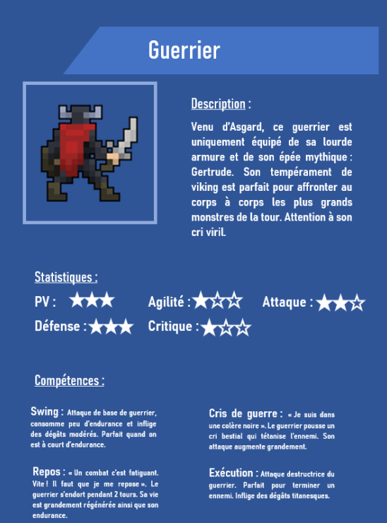
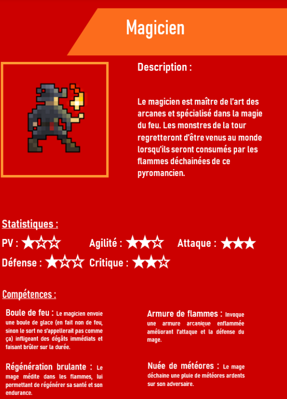
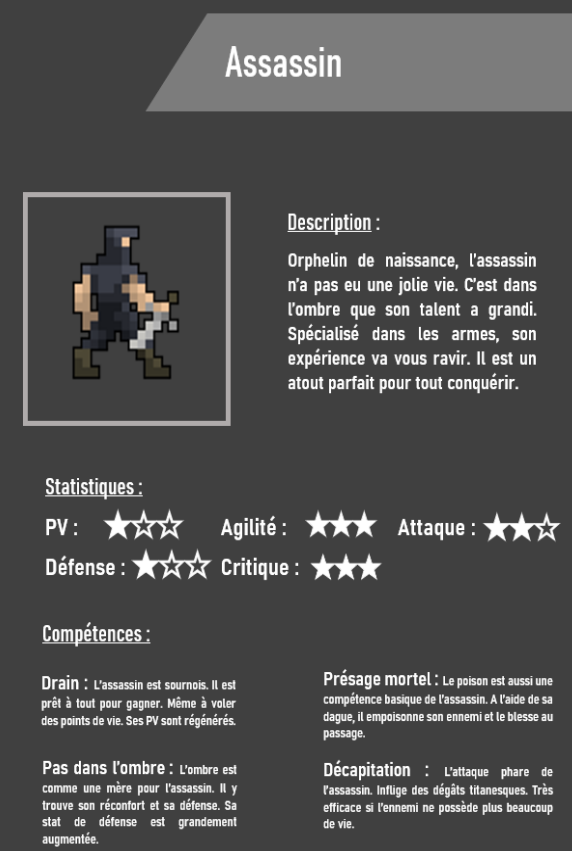

# **EmaTower**

This is my first Java project in engineering school. Made with Java Swing, this game is a Pokemon-like game. The music and the illustrations are handmade.

You can run the game from the *EmaTower.jar* file.

## A screenshot from the game 

## All heroes' cards

Secret cheat code : press P for level up !